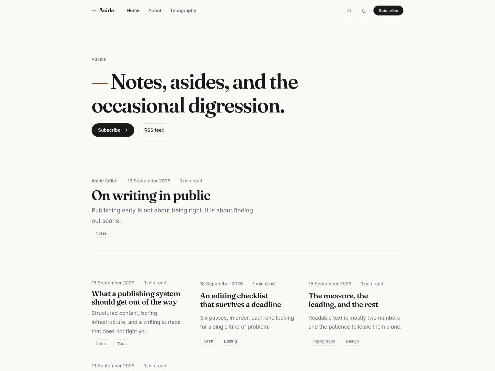

# Aside

A writing-first [Ghost](https://ghost.org) theme: editorial typography, warm paper in light and
dark, and the em dash as a house motif. Built for sites where the writing is the product.



## Features

- **Light and dark** from one palette, written with `light-dark()` — no separate dark stylesheet to
  maintain. Follows the operating system until a visitor picks a side.
- **Self-hosted type**: Fraunces and Inter ship with the theme, so there are no third-party font
  requests. Ghost's own font settings (Design → Typography) override them when set.
- **Follows your brand colour** from Ghost Admin → Design → Brand, with a terracotta default.
- **Built for Koenig**: wide and full-width cards break out of the reading measure; card assets are
  served by Ghost.
- **Members-aware** — subscribe prompts, Portal links and the account menu appear only when
  memberships are switched on.
- **Translatable**: all interface strings go through `{{t}}` and live in `locales/en.json`.
- **Ships with CI**: gscan on every pull request, and a one-push deploy to your Ghost site.

## Templates

| File             | Route                                                       |
| ---------------- | ----------------------------------------------------------- |
| `index.hbs`      | Home and paged archives — statement, lead story, post grid  |
| `post.hbs`       | Article — byline, feature image, content, read next, comments|
| `page.hbs`       | Static pages                                                 |
| `tag.hbs`        | Tag archive, dated list                                      |
| `author.hbs`     | Author archive with bio and links                            |
| `error-404.hbs`  | Not found                                                    |
| `error.hbs`      | Other errors                                                 |

## Theme settings

Editable in Ghost Admin → Design → Site-wide, no code needed:

| Setting             | Options                          | Default        |
| ------------------- | -------------------------------- | -------------- |
| Homepage header     | Statement / Compact / Hidden     | Statement      |
| Lead story          | on / off                         | on             |
| Title font          | Elegant serif / Modern sans-serif| Elegant serif  |
| Show reading time   | on / off                         | on             |
| Footer note         | free text                        | empty          |

## Development

```bash
npm install
npm run dev     # rebuild CSS and JS on change
npm run build   # one-off build into assets/built/
npm test        # build, then validate with gscan
npm run zip     # package aside.zip for manual upload
```

The theme is plain Handlebars and CSS. Sources live in `assets/css/` and `assets/js/`; PostCSS and
esbuild compile them into `assets/built/`, which is committed so the theme works when uploaded as a
zip without a build step.

To work on it against a real Ghost site, symlink or copy this directory into your site's
`content/themes/` folder, then activate **Aside** in Ghost Admin → Design.

```text
assets/
├── css/        source styles (vars, base, layout, components, post)
├── js/         theme.js — the light/dark switch, and nothing else
├── fonts/      self-hosted Fraunces and Inter, with their licences
└── built/      compiled output, committed
partials/       header, footer, cards, meta, pagination, icons
locales/        interface strings
```

## Deploying from GitHub

`.github/workflows/deploy-theme.yml` builds the theme, runs gscan, and pushes it to your site with
[TryGhost/action-deploy-theme](https://github.com/TryGhost/action-deploy-theme) on every push to
`main`.

1. In Ghost Admin → Integrations, add a custom integration and copy its **Admin API URL** and
   **Admin API key**.
2. In the GitHub repository → Settings → Secrets and variables → Actions, add them as
   `GHOST_ADMIN_API_URL` and `GHOST_ADMIN_API_KEY`.
3. Push to `main`. The workflow zips the theme (excluding sources and CI files) and activates the
   new version.

`.github/workflows/test.yml` runs gscan on pull requests and fails if `assets/built/` is out of date
with the sources.

## Notes

- **Comments** are an iframe rendered by Ghost, which reads its colour scheme once when it boots.
  The theme keeps it in step: `post.hbs` hands the visitor's saved choice to the embed on page load,
  and `theme.js` repaints the iframe canvas and flips the embed's own class when the theme is
  switched mid-page. Without that, a dark page shows a white panel where the comments are.
- **Reading time** comes from Ghost's `{{reading_time}}` helper and can be hidden in theme settings.
- **Search** is Ghost's own (Sodo Search); the header button carries `data-ghost-search`.

## Credits

Structure follows the conventions of [Casper](https://github.com/TryGhost/Casper), Ghost's default
theme (MIT). Typefaces: [Fraunces](https://fonts.google.com/specimen/Fraunces) and
[Inter](https://fonts.google.com/specimen/Inter), both under the SIL Open Font License, bundled in
`assets/fonts/`.

## License

MIT — see [LICENSE](LICENSE).
